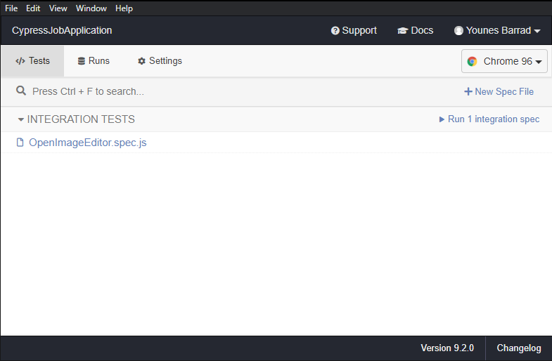

# Cypress Job Application

This repo contains one test written in Cypress.

## Help + Testing

The steps below will take you all the way through Cypress. It is assumed you have nothing installed except for node + git.

**If you get stuck, here is more help:**

* [Cypress Docs](https://on.cypress.io)

### 1. Clone this repo

```bash
## clone this repo to a local directory
git clone https://github.com/77Diamonds/website-tests.git

## cd into the cloned repo
cd website-tests

## install the node_modules
npm install

## run cypress
npm run cytest
```

The `npm run test` script will start testing all tests inside the integration folder with no interface.

### 2. Cypress Interface



you can easily run all tests just by clicking `Run integration spec` or by clicking on a specific spec file

### 3. Creating new tests

create new tests inside integration folder make sure it ends with `.spec.js`